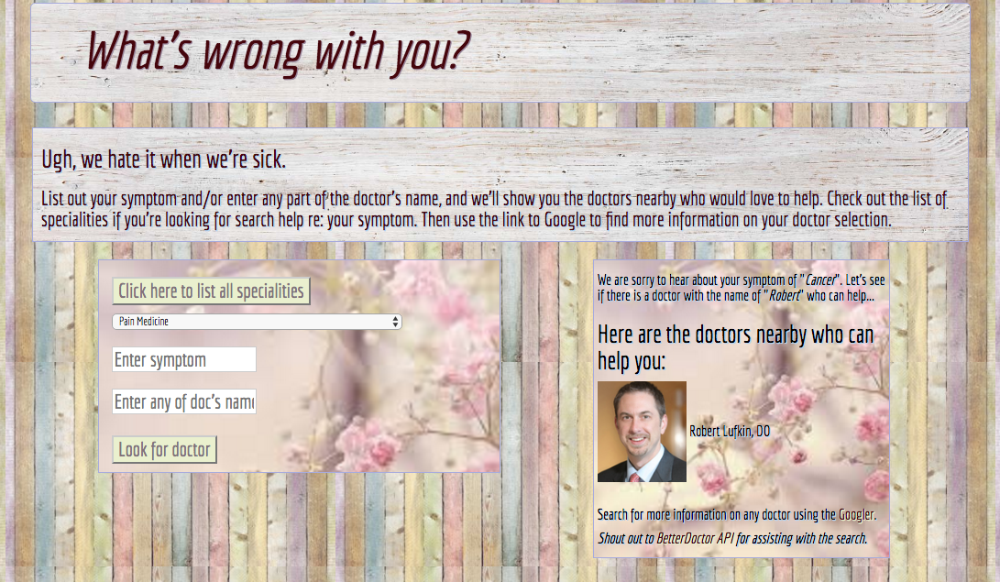

# _Doctor Lookup_

#### _Modern JavaScript Apps Independent Project for Epicodus, 08.04.2017_

By _Calla Rudolph_ [(e-mail me here)](<mailto:callarudolph@gmail.com>)

## Description

This app allows the user to enter a symptom or doctor name and view a list of corresponding doctors (with image) found in the Portland area. The app uses the [BetterDoctorAPI](https://developer.betterdoctor.com/) to retrieve results. The user can also view a list of specialities from the database. If there are no matches from the search, an error message appears.


_This image is a screenshot of the splash page after completing a search_

## Prerequisites

_You will need the following properly installed on your computer:_

[Node.js](https://nodejs.org/en/); _Once installed, you will need to install gulp and bower globally:_
  * `$ npm install gulp -g`
  * `$ npm install bower -g`

[Ruby](https://www.ruby-lang.org/en/downloads/); _Once installed, you will need to install sass globally:_
  * `$ gem install sass`


You will need your own API Key from [`BetterDoctorAPI`](https://developer.betterdoctor.com/):
* Visit the website and click `"Get a free API key"`.
* Fill out the form with your information and `check your email` to activate your account with their confirmation link.
* `Copy your personal API key` provided on the front page (ex: "a2c356ibgh44...") or under _My Account > Applications_.
* Create the `.env file` at the top level of your project folder and write: `exports.apiKey = "[PASTE-YOUR-API-KEY-HERE]";` and save the file.

## Configuration/Dependencies

* `npm`
  * `gulp`
    * bower-files, browser-sync, browserify, vinyl-source-stream, del, jshint, gulp-concat, gulp-uglify, gulp-util, gulp-jshint, gulp-sass, gulp-sourcemaps
  * `bower`
    * jQuery, Bootstrap

## Setup/Installation

* `Open GitHub site` on your browser: https://github.com/CallaRudolph/doctor
* Select the dropdown (green box) `"Clone or download"`
* `Copy` the link for the `GitHub repository`
* Open `Terminal` on your computer
* In Terminal, `perform the following steps`:
````
  $ cd desktop
  $ git clone <paste repository link>
  $ cd doctor
  $ npm install
  $ bower install
  $ gulp build
  $ gulp serve
  ````
* Your browser will open the app @ localhost:3000
* Enter a symptom and/or doctor name to get some help!

## Known Bugs

If you are having difficulty retrieving information from the API, try installing: [`Allow-Control-Allow-Origin`](https://chrome.google.com/webstore/detail/allow-control-allow-origi/nlfbmbojpeacfghkpbjhddihlkkiljbi?hl=en):
  * Click the green button on the top right of the pop-up labeled 'ADDED TO CHROME' and follow prompts.

## Technologies Used

JavaScript, JQuery, Bootstrap, Sass, Node.js, Bower, Gulp, HTML, CSS

### License
Copyright &copy; 2017 Calla Rudolph

_Please email me at the above address with any comments or improvements you have found!_

This software is licensed under the MIT license.
